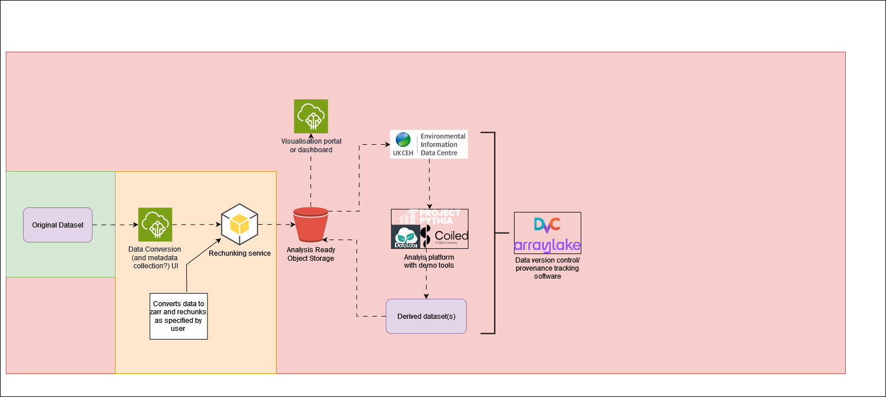

# DRI Gridded Data

DRI Gridded Data Repository. Work in progress. The idea with this repo is to develop a suite of tools to make working with large gridded datasets easier. This is outlined in the [diagram](https://github.com/NERC-CEH/dri_gridded_data/blob/main/img/gridded_data_tools_workflow_diagram.png) below. The background colours represent the progress of the work. Green = Done, Yellow = Actively being worked on, Red = Not started. 

The first product that we are developing is to allow for easy conversion of various gridded datasets to [ARCO](https://ieeexplore.ieee.org/abstract/document/9354557) ([Zarr](https://zarr.readthedocs.io/en/stable/)) format and easy upload to [object storage](https://github.com/NERC-CEH/object_store_tutorial?tab=readme-ov-file#what-is-object-storage). This product is built upon [pangeo-forge-recipes](https://pangeo-forge.readthedocs.io/en/latest/) which provides convenience functions for [Apache Beam](https://beam.apache.org/), which handles all the complexity of the performant parallelisation needed for rapid execution of the conversion. For more information on the reasons and motivation for converting data to ARCO format see the [README](https://github.com/NERC-CEH/object_store_tutorial) of the repository that generated the idea for this product. 

Currently the product has been designed for datasets stored in monthly netcdf files. The monthly file-frequency restriction is intended to be relaxed in future versions. 

# Developer information

[Product description document](https://cehacuk.sharepoint.com/:w:/s/FDRI-WP2Digital/EbX7pJCS6alKrckL_jU-Dd8B41KHJYWzEYN27qGHkWXL7w?e=8gnEbc)

## Local installation

- Download local copy of repository: `git clone git@github.com:NERC-CEH/dri_gridded_data.git`
- Create a conda environment from the environment.yml file: `conda create --name dri_gridded_data --file environment.yml`

## Structure

- Currently all the action takes place in the 'scripts' folder
- Within the scripts folder there is a folder for each dataset that has been converted
- Within each dataset's folder there is at least: a config file (yaml format) and a python script which runs the conversion process.

So there is currently one script for each dataset, however the latest script, which is currently the script for *chess-met*, is able to process the other datasets and any future datasets for which no further functionality is required (i.e. it is backwards-compatible with datasets processed earlier in the development process) Future work intends to just have one conversion script that works for all datasets, and just config files for the datasets. 

## Config

The config files contain the following user-configurable variables:
-  `start_year`: The year of the first file in the dataset (YYYY)
-  `start_month`: The month of the first file in the dataset (MM)
-  `end_year`: The year of the last file in the dataset (YYYY)
-  `end_month`: The month of the last file in the dataset (MM)
-  `input_dir`: The path to the directory/folder containing the dataset files
-  `filename`: A template for the filenames of the files, containing {varname} to substitute for varnames, {start_date} for a timestamp and optionally {end_date} for a second timestamp (e.g. if there is a range in the filename)
-  `varnames`: A list of all the variable names in the dataset. Currently the variable names in the filenames have to be the same as the variable names in the netcdf files.
-  `date_format`: A [python datestring format code](https://docs.python.org/3/library/datetime.html#format-codes) that represents the format of {start_date} (and {end_date} if present) in the filename 
-  `target_root`: The path to the folder in which to store the output zarr dataset
-  `store_name`: The name of the output zarr dataset
-  `target_chunks`: A dictionary with the dimension names of the desired output dataset chunking as the keys and size of these dimensions as the values
-  `num_workers`: Number of workers to use in the computation of the new dataset. Note that anything above 1 is currently experimental and may fail for weird reasons
-  `prune`: Used for testing. Instead of running with all the dataset's files, just use the first X
-  `overwrites`: "off" or "on". Whether or not to overwrite one or more of the dataset's variables with data from one of the dataset's files. Designed for coordinate variables that may differ slightly between different version of the dataset
-  `var_overwrites`: Optional. Which variables in the dataset to overwrite. If not specified and `overwrites` is "on", all variables that can be safely overwritten are
-  `overwrite_source`: Optional. Filename of a file in the dataset to use to source the variables' data to use to overwrite. If not specified and `overwrites` is "on", the last file of the dataset is used. 

## Running instructions

- The python conversion scripts take in the config file as their only argument so to run one:
- `ipython path/to/convert/script.py path/to/config/file.yaml`
- Memory usage can be an issue for datasets >=O(100GB), due to the usage of Beam's rough-and-ready 'Direct Runner', which is not designed for operational use. Usage of an HPC is recommended for such datasets. An example batch job submission script for SLURM-based HPCs is available in the 'chess-met' folder.

# Disclaimer

THIS REPOSITORY IS PROVIDED THE AUTHORS AND CONTRIBUTORS “AS IS” AND ANY EXPRESS OR IMPLIED WARRANTIES, INCLUDING, BUT NOT LIMITED TO, THE IMPLIED WARRANTIES OF MERCHANTABILITY AND FITNESS FOR A PARTICULAR PURPOSE ARE DISCLAIMED. IN NO EVENT SHALL THE AUTHORS OR CONTRIBUTORS BE LIABLE FOR ANY DIRECT, INDIRECT, INCIDENTAL, SPECIAL, EXEMPLARY, OR CONSEQUENTIAL DAMAGES (INCLUDING, BUT NOT LIMITED TO, PROCUREMENT OF SUBSTITUTE GOODS OR SERVICES; LOSS OF USE, DATA, OR PROFITS; OR BUSINESS INTERRUPTION) HOWEVER CAUSED AND ON ANY THEORY OF LIABILITY, WHETHER IN CONTRACT, STRICT LIABILITY, OR TORT (INCLUDING NEGLIGENCE OR OTHERWISE) ARISING IN ANY WAY OUT OF THE USE OF THIS REPOSITORY, EVEN IF ADVISED OF THE POSSIBILITY OF SUCH DAMAGE.
