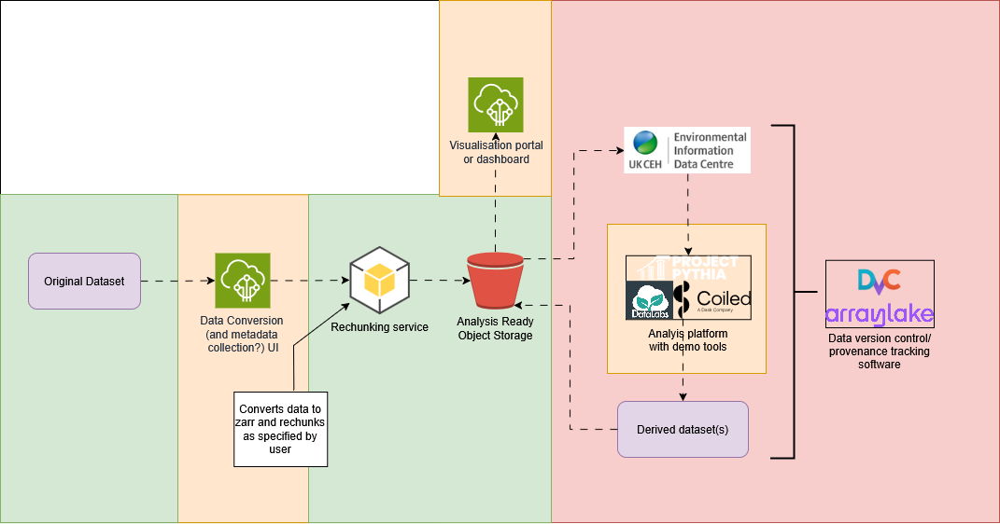

# Datasets
This repository contains scripts for converting the following datasets, downloadable from the EIDC:
- [CHESS-met, E.L. Robinson, E.M. Blyth et al.](https://doi.org/10.5285/835a50df-e74f-4bfb-b593-804fd61d5eab)
- [GEAR(hourly), E. Lewis, N. Quinn et al. ](https://doi.org/10.5285/fc9423d6-3d54-467f-bb2b-fc7357a3941f)
- [GEAR(daily), M. Tanguy, H. Dixon et al.](https://doi.org/10.5285/dbf13dd5-90cd-457a-a986-f2f9dd97e93c)

# DRI Gridded Data

DRI Gridded Data Repository. Work in progress. The idea with this repo is to develop a suite of tools to make working with large gridded datasets easier. This is outlined in the [diagram](https://github.com/NERC-CEH/dri_gridded_data/blob/main/img/gridded_data_tools_workflow_diagram.png) below. The background colours represent the progress of the work. Green = Completed for now, Yellow = Actively being worked on, Red = Not started. 



The first product that we are developing is to allow for easy conversion of various gridded datasets to [ARCO](https://ieeexplore.ieee.org/abstract/document/9354557) ([Zarr](https://zarr.readthedocs.io/en/stable/)) format and easy upload to [object storage](https://github.com/NERC-CEH/object_store_tutorial?tab=readme-ov-file#what-is-object-storage). This product is built upon [pangeo-forge-recipes](https://pangeo-forge.readthedocs.io/en/latest/) which provides convenience functions for [Apache Beam](https://beam.apache.org/), which handles all the complexity of the performant parallelisation needed for rapid execution of the conversion. For more information on the reasons and motivation for converting data to ARCO format see the [README](https://github.com/NERC-CEH/object_store_tutorial) of the repository that generated the idea for this product. 

Currently the product has been designed for datasets stored in monthly netcdf files. The monthly file-frequency restriction is intended to be relaxed in future versions. 

# Developer information

[Product description document](https://cehacuk.sharepoint.com/:w:/s/FDRI-WP2Digital/EbX7pJCS6alKrckL_jU-Dd8B41KHJYWzEYN27qGHkWXL7w?e=8gnEbc)

## Config

The config files in the "config" folder contain the following user-configurable variables:
-  `start_year`: The year of the first file in the dataset (YYYY)
-  `start_month`: The month of the first file in the dataset (MM)
-  `end_year`: The year of the last file in the dataset (YYYY)
-  `end_month`: The month of the last file in the dataset (MM)
-  `frequency`: The file frequency, currently supports "M" (for monthly files) and "D" (for daily files). 
-  `skipdates`: Optional. A list of dates to skip and not include in the conversion. Files with the listed dates (YYYY, YYYY-MM or YYYY-MM-DD) will be skipped.
-  `input_dir`: The path to the directory/folder containing the dataset files
-  `filename`: A template for the filenames of the files, containing {varname} to substitute for varnames, {start_date} for a timestamp and optionally {end_date} for a second timestamp (e.g. if there is a range in the filename)
-  `filetype`: Optional. Type of netcdf files input. Only needed if the files are not netcdf4 (most now are), in which case use "netcdf3"
-  `varnames`: A list of all the variable names in the dataset. Currently the variable names in the filenames have to be the same as the variable names in the netcdf files.
-  `date_format`: A [python datestring format code](https://docs.python.org/3/library/datetime.html#format-codes) that represents the format of {start_date} (and {end_date} if present) in the filename 
-  `target_root`: The path to the folder in which to store the output zarr dataset
-  `store_name`: The name of the output zarr dataset
-  `concatdim`: The name of the dimension that the individual files will be concatenated along. Usually "time". Note this is separate to the merging of variables stored in separate files, wh
ich is handled by varnames
-  `target_chunks`: A dictionary with the dimension names of the desired output dataset chunking as the keys and size of these dimensions as the values
-  `num_workers`: Number of workers to use in the computation of the new dataset. Note that anything above 1 is currently experimental and may fail for weird reasons
-  `prune`: Used for testing. Instead of running with all the dataset's files, just use the first X
-  `overwrites`: "off" or "on". Whether or not to overwrite one or more of the dataset's variables with data from one of the dataset's files. Designed for coordinate variables that may differ slightly between different version of the dataset
-  `var_overwrites`: Optional. Which variables in the dataset to overwrite. If not specified and `overwrites` is "on", all variables that can be safely overwritten are
-  `overwrite_source`: Optional. Filename of a file in the dataset to use to source the variables' data to use to overwrite. If not specified and `overwrites` is "on", the last file of the dataset is used. 

# UV Setup and running instructions
> Note: The python version is pinned to `3.10` as `pyarrow` cannot currently be built with later versions ([Stackoverflow discussion](https://stackoverflow.com/a/77318636)). Additionally there are import issues with `zarr` `FSSpec`.

To run the scripts in this repository using `uv`, first download and install using the instructions in the [Astral documentation](https://docs.astral.sh/uv/getting-started/installation/). Once installed, run the following commands to download all dependencies and create a virtual environment:
```
uv sync
uv venv
```
All scripts should now be runnable using `uv run` e.g.:
```
uv run scripts/<CONVERSION_SCRIPT.py> <CONFIG_FILE.yaml>
```

> Note: Memory usage can be an issue for datasets >=O(100GB), due to the usage of Beam's rough-and-ready 'Direct Runner', which is not designed for operational use. Usage of an HPC is recommended for such datasets.


## Tests
### Downloading and preparing the data
The package contains integration tests for the various converters of the datasets listed above. These tests use real samples of the datasets that must first downloaded and prepared using `scripts/download_test_data.py`. To run, you must have login access to download the above datasets on the EIDC and then create a `.env` file containing your login details:
```
username=YOUR_USERNAME
password=YOUR_PASSWORD
```
You can then run:
```
uv run scripts/download_test_data.py
```
This will download a test file for each dataset and place them in `data/`. It will also create sub-samples from these files and add them to `data-tiny/` - these will be used by the integration tests.

### Running tests
There are a set of integration tests (marked as `@pytest.mark.integration`) that can be run using:
```
uv run pytest -m integration
```
These tests will convert using the recipes defined for each dataset and then check that the resulting output is as expected.
> **Note:** These integration tests can also be run with the full file samples, but this may take several minutes.


# Disclaimer

THIS REPOSITORY IS PROVIDED THE AUTHORS AND CONTRIBUTORS “AS IS” AND ANY EXPRESS OR IMPLIED WARRANTIES, INCLUDING, BUT NOT LIMITED TO, THE IMPLIED WARRANTIES OF MERCHANTABILITY AND FITNESS FOR A PARTICULAR PURPOSE ARE DISCLAIMED. IN NO EVENT SHALL THE AUTHORS OR CONTRIBUTORS BE LIABLE FOR ANY DIRECT, INDIRECT, INCIDENTAL, SPECIAL, EXEMPLARY, OR CONSEQUENTIAL DAMAGES (INCLUDING, BUT NOT LIMITED TO, PROCUREMENT OF SUBSTITUTE GOODS OR SERVICES; LOSS OF USE, DATA, OR PROFITS; OR BUSINESS INTERRUPTION) HOWEVER CAUSED AND ON ANY THEORY OF LIABILITY, WHETHER IN CONTRACT, STRICT LIABILITY, OR TORT (INCLUDING NEGLIGENCE OR OTHERWISE) ARISING IN ANY WAY OUT OF THE USE OF THIS REPOSITORY, EVEN IF ADVISED OF THE POSSIBILITY OF SUCH DAMAGE.
